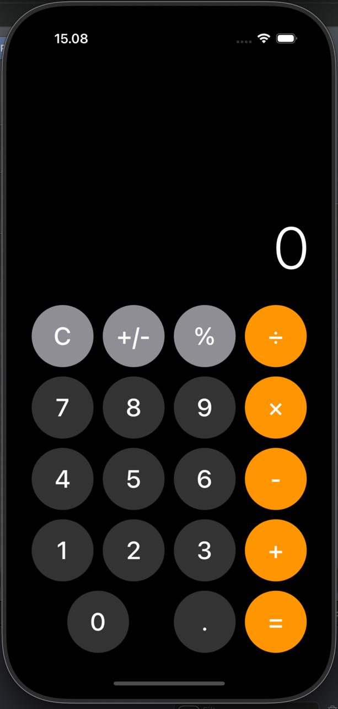

# iOS Calculator App

A simple iOS Calculator app built using Swift and SwiftUI. The app provides basic arithmetic operations like addition, subtraction, multiplication, and division. The app's clean and user-friendly interface makes it easy to perform quick calculations.

## Features

- Basic arithmetic operations: `+`, `-`, `*`, `/`
- Clear and backspace functionality
- Simple and intuitive interface
- Dark mode support
- Responsive UI for different screen sizes

## Screenshots

  
*Example screenshot of the app in action.*

## Installation

1. Clone this repository to your local machine:

    ```bash
    git clone https://github.com/feboyfierlyan/IOS-calculator.git
    ```

2. Open the `calculator.xcodeproj` file in Xcode.

3. Select your desired simulator or device to run the app.

4. Press `Cmd + R` to build and run the app.

## Usage

After launching the app, simply tap the buttons to perform calculations. You can tap the `C` button to clear the display, or the `←` button to delete the last character.

## Requirements

- iOS 14.0+
- Xcode 12.0+
- Swift 5.0+

## Contributing

1. Fork this repository.
2. Create a new branch for your changes (`git checkout -b feature-name`).
3. Commit your changes (`git commit -am 'Add new feature'`).
4. Push to the branch (`git push origin feature-name`).
5. Create a new Pull Request.

## License

This project is licensed under the MIT License - see the [LICENSE](LICENSE) file for details.

## Acknowledgments

- SwiftUI framework for building the user interface.
- Inspiration taken from various iOS calculator apps.
- Special thanks to open-source contributors for their valuable resources.

